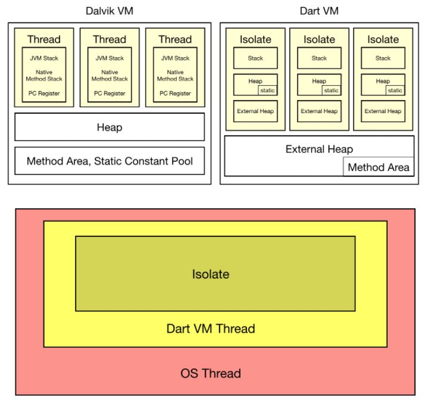

# Dart Isolate

Dart에선 스레드와 같은 개념을 Isolate라고 한다. 그리고 자체 관리 스레드를 생성하지 않고 Embeder가 책임지도록 한다. Embeder는 Flutter Engine에 있다. Isolate는 ISolated memory heap의 추상화이다. Isolate는 메모리를 공유하지 않는 Self-contained Application을 추구하고 Isolated 간 통신은 메시지 채널을 이용한다.

