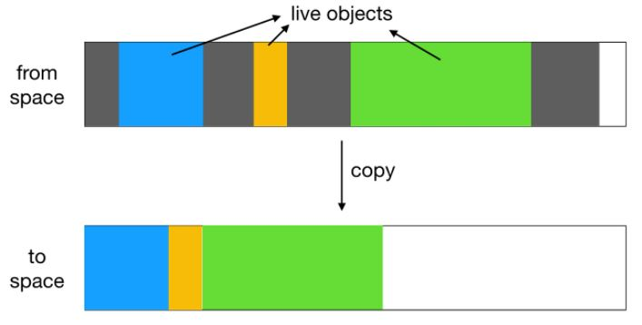

# Dart의 메모리 관리

이 장에서는 Dart의 메모리 관리를 기술한다

## 가비지 컬렉터

다트의 VM은 New Generation, Old Generation으로 나뉜다. GC가 발생하면 현재 사용중인 메모리 블록에서 참조중인 객체만 다른 스페어 메모리로 복사가 되고 두 메모리 블럭의 역할이 교체된다. DartVM은 객체 복사가 완료된 스페어 메모리를 현재 메모리로 사용하고 기존의 메모리 블럭을 삭제하는 식으로 GC를 마무리한다.

[이 과정이 JVM이랑 유사하다 하여 관련 링크도 첨부한다](https://d2.naver.com/helloworld/1329)

## Flutter의 Image Memory

Flutter의 Image Widget은 Graphics 메모리를 사용한다.
안드로이드의 프로파일러를 참조하면 Graphics메모리를 점유함을 알 수 있는데 안드로이드의 메모리 종류는 아래와 같다.

- Java: java 또는 Kotlin 코드에 할당된 객체의 메모리
- Native: C or C++ 코드에서 할당된 객체의 메모리
- Graphics: GL Surface, GL Texture등 화면에 픽셀을 표시하기 위한 그래픽 버퍼 큐에 사용되는 메모리 (전용 GPU 메모리가 아니라 CPU와 공유되는 메모리)
- Stack: 앱에서 네이티브 스택과 Java 스택에 모두 사용되는 메모리. 보통 앱에서 실행중인 스레드 수와 관계가 있다.
- Code: dex 바이트코드, 최적화 or 컴파일된 dex 코드, .so 라이브러리, 글꼴 등과 같이 앱이 코드와 리소스를 위해 사용하는 메모리
- Other: 앱에서 사용하는 메모리 중 시스템이 명확하게 분류하지 못한 메모리
- Allocated 앱에서 할당한 java/Kotlin 객체의 수. Native에서 할당하는 객체는 제외한다.

[위 메모리는 이 자료를 참조하였다](https://developer.android.com/studio/profile/memory-profiler)
