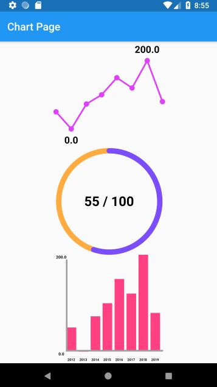

# custom chart

아래의 차트를 CustomPaint widget을 사용하여 구현하려고 한다.



## text util

Text의 경우 ParagraphBuilder를 사용하지 않고 TextWidget을 이용해 그리는 TextPainter를 활용하였다.

```Dart
TextSpan sp = TextSpan(
    style: TextStyle(fontsize, fontweight, color),
    text: text
);

TextPainter tp = TextPainter(text: sp, textDirection: TextDirection.tlr);

tp.layout(); //text 를 그리기 위해 glyphs의 시각적 위치를 계산

tp.paint(canvas, offset);
```

## pie_chart

Pie 차트는 입력받은 percentage의 비중을 시각화하도록 구현하였다.

chart는 drawCircle을 호 형태로 그려 구현하였다.

```Dart

```

## ref

- https://software-creator.tistory.com/23
