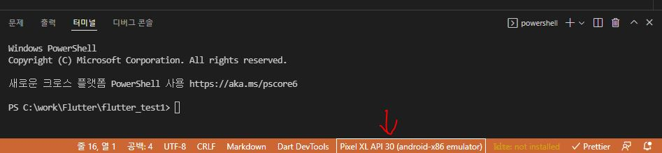
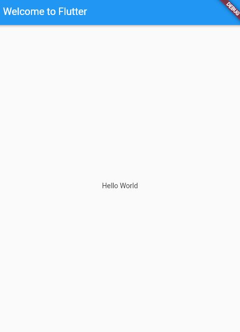

# Fluter hello world

이번 챕터에서는 vs code에서 flutter 프로젝트 생성과 hello world 기본 앱을 구현한다.

## Flutter project 생성

### windows + vs code

`ctrl + shift + p` 를 눌러 명령팔렛트를 열고
`Flutter: New Project` 를 입력하여 프로젝트 생성을 해준다.

## Flutter project 실행

### windows + vs code



- vs code 하단의 devices selecte를 클릭하여 알맞은 디바이스를 선택한다.
- project의 lib/main.dart에서 실행을 하면 되는데,
- 그냥 실행하게 되면 dart 프로젝트로 인식하여 아래와 같이 dart:ui를 찾지 못하는 오류가 발생한다.

```bash
lib/main.dart: Warning: Interpreting this as package URI, 'package:flutter_test1/main.dart'.

/C:/flutter/packages/flutter/lib/src/material/animated_icons.dart:9:8: Error: Not found: 'dart:ui'
```

- dart:ui는 flutter에서 skia와 shell에 접근하여 ui, canvas 등 graphic 작업을 할 수 있도록 제공해 주는 library이다.
- 때문에 main.dart를 flutter engine 없이 dart vm 위에서 run하게 되면 오류가 발생한다.
- Flutter engine과 함께 JIT모드로 run하여 개발하기 위해선 debug로 실행해 줘야 한다.

## hello world

```Dart
import 'package:flutter/material.dart';

void main() {
  runApp(const MyApp());
}

class MyApp extends StatelessWidget {
  const MyApp({Key? key}) : super(key: key);

  @override
  Widget build(BuildContext context) {
    return MaterialApp(
      title: 'Welcome to Flutter',
      home: Scaffold(
        appBar: AppBar(
          title: const Text('Welcome to Flutter'),
        ),
        body: const Center(
          child: Text('Hello World'),
        ),
      ),
    );
  }
}
```



## 분석

- 해당 예제에서는 Material 을 사용하여 App을 만든것을 볼 수 있다.
- Material은 mobile, web에서 표준이 되는 시각 디자인 언어이다.
- Flutter는 Material에 맞는 풍부한 Widget을 제공하고 이를 이용하여 App을 구현할 수 있다.
- Material Design을 사용하기 위해선 pubspec.yaml의 `flutter` 섹션에 `uses-material-design: true`을 추가하면 된다.
- StatelessWidget은 App 자체를 widget으로 만드는 App extends이다.
- Scaffold widget은 widget tree로 기본 app bar 와 화면을 구성할 수 있는 Material library이다.
- widget은 build란 method를 제공하고 이 methed 에는 하위 레벨 widget을 기술한다.
